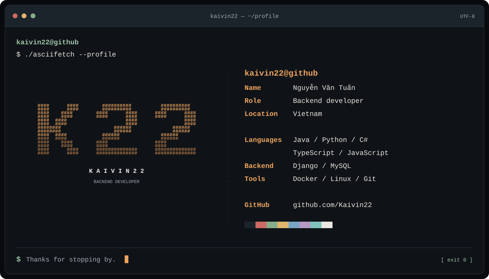

<!-- Generated by scripts/build_profile.py. Edit profile.json, then rebuild. -->

<picture>
  <source media="(max-width: 640px)" srcset="assets/profile-terminal-mobile.svg">
  
</picture>

<p align="center">
  <a href="https://github.com/Kaivin22?tab=repositories"><code>./repositories</code></a>
  &nbsp;·&nbsp;
  <a href="https://github.com/Kaivin22?tab=stars"><code>./stars</code></a>
  &nbsp;·&nbsp;
  <a href="https://github.com/Kaivin22?tab=overview"><code>./activity</code></a>
</p>

### `~ $ whoami`

Hi, I'm Tuấn. My work centers on backend development, with a toolkit that spans web, mobile, and infrastructure.

### `~ $ cat stack.conf`

| Module | Toolkit |
| :--- | :--- |
| `languages` | Java · Python · C# · TypeScript · JavaScript |
| `backend` | Django · MySQL · Magento |
| `mobile` | React Native · Xamarin |
| `environment` | Docker · Linux · Git |
| `editors` | Android Studio · Eclipse |

### `~ $ ls github/`

- [Repositories](https://github.com/Kaivin22?tab=repositories) — Browse my code and projects.
- [Starred projects](https://github.com/Kaivin22?tab=stars) — Explore the projects I follow.
- [Contributions](https://github.com/Kaivin22?tab=overview) — See my latest public activity.

<details>
<summary><code>cat profile.txt</code> — plain-text version</summary>

```text
kaivin22@github
------------------------------
Name       Nguyễn Văn Tuấn
Role       Backend developer
Location   Vietnam

Languages  Java / Python / C#
           TypeScript / JavaScript
Backend    Django / MySQL
Tools      Docker / Linux / Git

GitHub     github.com/Kaivin22
```

</details>

---

<p align="center">
  <sub>Terminal design inspired by <a href="https://github.com/ganji759/asciifetch">asciifetch</a> · Built with text, kept simple.</sub>
</p>
